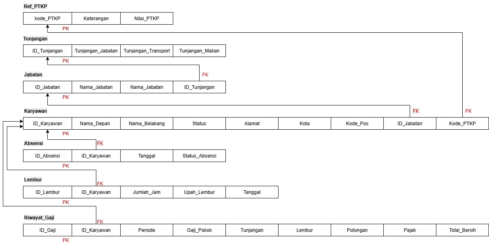

# payroll-system-database
A university database project (UTS) for a payroll system, focusing on normalization, 15 nested queries, and query performance testing against large dummy datasets (10, 100, 1k, 10k rows) using PostgreSQL.

## 🚀 Project Objectives

The main goal of this project is to fulfill the midterm assignment requirements, which include:
1.  **Database Normalization**: Analyzing and documenting the normalization process applied to the database schema.
2.  **Dummy Data Generation**: Creating four distinct dummy datasets with different scales (10, 100, 1,000, and 10,000 rows) to simulate a realistic database environment.
3.  **15 Nested Queries**: Writing 15 relevant nested queries (subqueries) to address the business requirements of the payroll system.
4.  **Performance Analysis**: Measuring and comparing the `query time` (execution time) for each query against the four different dummy datasets.

## 📊 Database Schema

The database design (PDM) includes several relational tables to manage employee data, job positions, attendance, overtime, and salary history.

The main tables include:
* `Karyawan`
* `Jabatan`
* `Tunjangan`
* `Ref_PTKP`
* `Absensi`
* `Lembur`
* `Riwayat_Gaji`

## 💻 Tech Stack
* **Database:** PostgreSQL
* **Tool:** Navicat
* **Data Dummy Generator:** Excel, [Data Dummy Maker](https://smalldev.tools/test-data-generator-online)

## 📂 Repository Contents
* **/sql-scripts**: Contains SQL scripts for the database structure (DDL), the 15 nested queries, and (optionally) dummy data generation scripts.
* **/report**: Contains the final project report, including the normalization analysis and the query time comparison tables.
